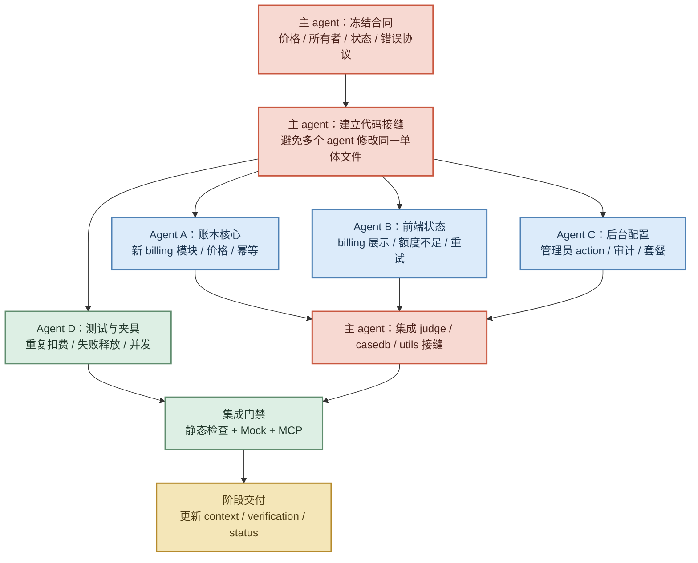

# 技术 Plan：模型调用积分体系与账户额度

## 影响范围

- 允许修改的文件：`cloudfunctions/judge/`、`cloudfunctions/billing-admin/`、必要的 `utils/ai.js`、相关额度提示页面、`docs/specs/active/2026-08-23-ai-credit-system/`。
- 不修改的文件：Home 页面主流程、支付系统、真实账户数据、外部平台密钥。
- 页面和路由：不新增业务路由；AI 调用页面只显示非阻塞的失败/重试状态，最后庭审结束页增加本次账单摘要卡片。
- 工具模块：扩展 AI 请求结果协议，补充 requestId 和 billing 信息。
- 云函数 action：Phase 1 在 `judge` 内接入账本模块，减少一次云函数间网络跳转；后台管理员 action 独立在 `billing-admin`，`casedb` 继续只负责案件，不承载积分账户。
- 数据字段：Phase 1 先落地 `ai_accounts`、`ai_credit_ledger`、`ai_usage` 三个核心集合；管理员审计使用 `ai_admin_audit`，套餐配置 `ai_plans` 可在后台配置阶段补齐。

## 实现方案

1. 服务端从微信上下文取得 OPENID。
2. 根据 action、输入类型和当前价格版本解析本次费用。
3. 用 idempotencyKey 做重复请求判断。
4. 原子预扣可用积分并增加 reserved 数量。
5. 调用预处理模型和 `deepseek/deepseek-v4-flash`。
6. 结果通过 Schema/隐私/业务校验后结算；失败则释放或退款。
7. 写入 `ai_usage` 和 `ai_credit_ledger`，响应统一 billing 字段。

### Demo 阶段展示规则

- AI action 执行期间不展示积分 modal、toast 或其他打断式提示。
- 本次庭审以同一轮运行标识累计账单；只有进入最后庭审结束页后，才显示一次页面内摘要。
- `settled` 显示“本次消耗”；`shadow/mock/not_charged` 显示“预计消耗”；`released` 不计入消耗并显示失败释放状态。
- 额度不足、调用失败和未知账单状态只在当前页面以内嵌方式说明，不阻塞用户操作；不得用预计消耗冒充真实扣费。

MVP 计费边界：`verdict` 与 `verdictDepth` 先分别扣费；`interview` 按一个逻辑 action 的固定预算计费，内部多次模型调用只记录 `subCallCount`，不临时拆分扣费。合并 trial bundle 属于 Phase 2，前置条件是服务端具备 `trialRunId`、`caseDocId`、`caseVersion` 和 `billingGroupId`。

账户配置优先级：单账号覆盖 > 套餐 > 全局默认。所有配置带版本和生效时间。

## 并行开发方案

目标是让 subagent 在不互相覆盖文件的前提下并行推进，主 agent 只保留规格冻结、关键集成和最终验收。

### Agent 文件所有权

| 角色 | 可以写 | 不可以写 | 输出 |
|---|---|---|---|
| 主 agent | `judge/index.js`、公共协议、最终集成；仅在案件归属确有需要时修改 `casedb/index.js` | 无评审直接覆盖其他 agent 的文件 | 合并、冲突解决、最终验证 |
| Agent 0 契约 | `spec.md`、`plan.md`、契约/价格文档 | 业务源码和页面 | action registry、价格版本、billing Envelope |
| Agent A 账本 | 新增 `cloudfunctions/judge/billing/` 下的纯模块和单元测试 | `judge/index.js`、`casedb/index.js` | 价格解析、预扣、结算、释放、幂等接口 |
| Agent B 后台 | 独立管理员 action 模块或后台工具目录、审计 schema | `judge/index.js`、普通用户页面 | 管理员权限、账户配置和审计操作 |
| Agent C 计量 | 新增 `cloudfunctions/judge/telemetry.js` 和测试夹具 | `judge/index.js` | requestId、模型/Prompt/Schema 版本、耗时、token usage |
| Agent D 客户端协议 | `utils/ai.js`、新增 `utils/credit.js` | 云函数和页面视觉实现 | billing 返回、错误码和 Mock 适配 |
| Agent E 账务验证 | `docs/qa/credit-system/`、测试夹具、验证矩阵 | 业务源码 | 重复扣费、失败释放、并发和额度不足证据 |
| Agent F 运行验证 | 验证记录、MCP 场景、截图索引 | 业务源码和配置 | 开发者工具编译、MCP 路由/数据断言 |
| Agent G 判决页适配 | `pages/trial/`、`pages/verdict/`、`pages/interview/` | judge、账本和其他页面 | 判决/问话页面 billing 状态 |
| Agent H 输入页适配 | `pages/statement/`、`pages/evidence/`、`pages/their-statement/`、`pages/accept/`、`pages/preview/`、`pages/reply/`、`utils/voice.js` | judge、账本和判决页 | 输入/媒体页面 billing 状态 |
| Agent I 最终审查 | 无需写文件，或只更新审查记录 | 不直接改业务实现 | 权限、隐私、回滚和范围审查 |

### 并行规则

- `cloudfunctions/judge/index.js`、`cloudfunctions/casedb/index.js` 和 `utils/ai.js` 是集成热点；同一波次只能由一个 agent 修改其中一个文件，最好由主 agent 最后统一接入。积分 MVP 默认不改 `casedb`。
- `app.js`、`app.json`、`cloudfunctions/judge/prompts.js`、`docs/status.md` 和 `docs/technical-architecture.md` 属于中央集成面，不分配给并行 agent。
- 任何 agent 开始前必须读取当前 spec、`git status` 和自己的允许写入范围。
- agent 不提交、不推送、不上传云函数、不调用真实外部 AI；只在自己的 fork/worktree 修改并返回文件清单、测试结果和风险。
- 主 agent 合并前先查看 diff，再运行静态检查；发现越界文件或混入业务重构时退回，不在集成阶段顺手扩大范围。
- 先合并接口和契约，再合并实现；先合并账本核心，再接入 judge，最后接入页面。

### Agent 交付格式

每个 agent 必须返回：

1. 完成内容和未完成内容；
2. 修改文件的绝对路径；
3. 运行过的检查命令和结果；
4. 对其他 agent 的接口依赖；
5. 已知风险、回滚方式和是否需要主 agent 决策。

### 推荐的并行批次

为了缩短首个可运行版本的时间，按依赖关系拆成三个批次，而不是让所有 agent 同时碰主流程：

| 批次 | 可并行轨道 | 完成门槛 |
|---|---|---|
| Wave 0 | 主 agent：冻结价格、OPENID 账户、独立 action 计费、失败释放、`BILLING_MODE`；契约 agent：冻结 Envelope 和错误码 | 不再存在会改变数据结构的未决问题 |
| Wave 1 | 账本纯模块、事务能力 spike、客户端协议适配、后台权限/审计设计、Mock/并发测试夹具 | 每条轨道只新增文件，能独立通过检查 |
| Wave 2 | 主 agent 顺序接入 judge；页面 agent 按页面族并行接入状态；验证 agent 并行准备 DevTools/MCP 场景 | judge 每个出口均有明确账务终态，页面不再把失败当成功 |
| Wave 3 | 静态检查、账务一致性、页面 Mock、开发者工具/MCP 冒烟并行 | Gate 0–5 全部通过，才能扩大 live 范围 |

页面 agent 以“页面族”为边界：输入/媒体、回复/预览、判决/问话分别独占文件；公共 `utils/ai.js`、`app.js` 和云函数入口只能由主 agent 收口。后台 UI 不进入普通小程序主包，先提供独立管理 action 或私有管理工具。

### 主 agent 的集成顺序

1. 先验证当前云函数运行时的事务/条件更新能力；不通过则停止接入，先确定幂等补偿实现。
2. 接入 `requestId`、`idempotencyKey` 和只读计量，不改变现有 Mock 页面结果。
3. 接入单 action 的 `quote → reserve → call → capture/release`，先覆盖 `intake`、`brief`、`verdict`。
4. 再覆盖图片、语音、多轮追问和页面状态；`verdictDepth` 暂时作为独立 action。
5. 最后接后台发放、扣回、冻结、套餐绑定和审计；不改 `casedb` 的案件 action。

任何模型调用都不能放在数据库事务中；预扣事务成功后才调用外部模型，调用结束再以幂等方式结算或释放。重复请求输入发生变化时返回 `IDEMPOTENCY_CONFLICT`，不能复用旧结果。

## 状态、数据流与失败处理

- 重复点击：相同幂等键返回原请求状态，不新增扣费。
- 空数据：不发起模型调用，或按 action 返回明确的输入错误，不消耗积分。
- 网络/云函数失败：释放预扣积分，返回可重试状态。
- AI 超时或格式错误：释放预扣积分；不使用 Mock 结果伪装 live 结果。
- Demo 展示：不弹积分 modal/toast；额度不足和失败使用页面内状态，最后庭审结束页只展示累计摘要。
- 权限不足：管理员 action 返回统一拒绝；普通用户只能读取自己的余额摘要。
- 并发请求：必须用数据库事务或条件更新，不能使用“先读余额再普通更新”。

## 验证方案

- 静态检查：Node.js 全量语法、JSON 配置、集合字段和 action 白名单检查。
- 微信开发者工具：本地 Mock 下验证额度充足、额度不足、失败恢复和重复点击。
- MCP/冒烟场景：验证一次 AI 请求的 requestId、billing、页面状态和返回路由。
- 人工或真机确认：暂不接支付；后台管理员身份和真实云数据库权限需人工确认。

## 不采用的方案

- 不在前端计算费用。
- 不直接修改账户余额而不写账本。
- 不使用全局单例余额代替 OPENID 账户。
- 不在第一版按 Token 实时扣费。
- 不把支付订单、人民币金额和模型积分混在同一张表。

## 回滚方式

- 首轮通过 `BILLING_MODE=shadow` 或 `BILLING_MODE=mock` 关闭实际扣费，只保留 billing Envelope 和只读计量；`enforced` 在数据库适配器完成后才允许启用。
- 关闭开关后不得删除账本和调用记录。
- 如账务实现出现异常，暂停 live AI 调用或回到明确的本地 Mock，不展示伪造的真实结果。
