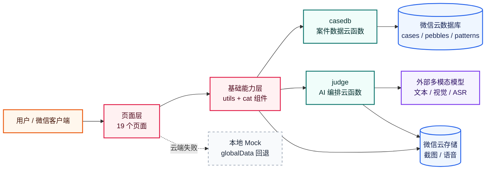
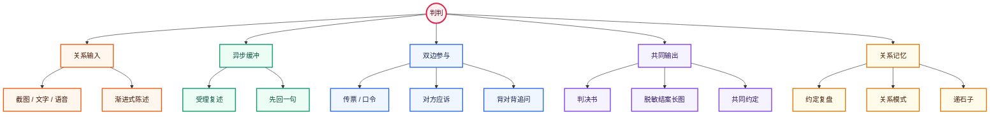
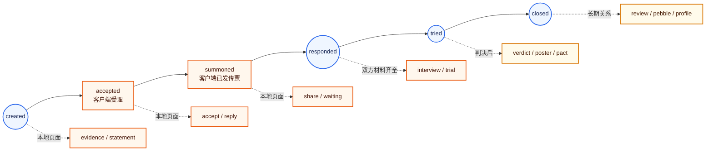
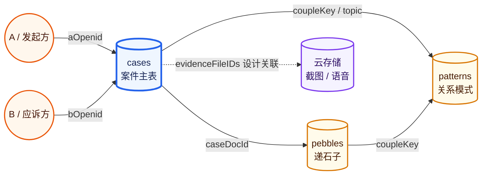
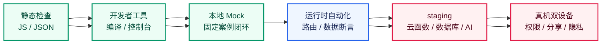

# 判判小程序技术架构

> 文档类型：代码库技术架构说明  
> 盘点对象：07-代码/miniprogram-demo/  
> 盘点基线：当前工作区；最近一次代码提交为 bb582bf（分支 rainno）  
> 盘点时间：2026-08-23  
> 口径：区分“代码已实现”“本地 Mock 可演示”“真实云端待验收”和“规划建议”

## 1. 一句话概览

判判当前是一个原生微信小程序 MVP：前端用 WXML、WXSS、JavaScript、JSON 实现情侣关系案件流程；云端用微信云函数承载案件数据层和 AI 编排层；AI 云函数通过 HTTPS 调用 OpenAI-compatible 外部模型；当云开发或 AI 不可用时，前端回退到 app.globalData 中的本地 Mock 数据。

当前架构适合黑客松演示和产品原型验证，尚未达到真实敏感关系数据的生产级安全与一致性要求。

### 1.1 总体分层图

图中颜色含义：橙色为用户入口，玫红为客户端，青绿色为云端服务，蓝色为数据与文件，紫色为外部模型，灰色虚线为演示回退路径。

## 2. 技术栈

| 层级 | 当前技术 | 主要用途 | 当前状态 |
|---|---|---|---|
| 客户端 | 原生微信小程序 | 页面、交互、权限、分享、录音、图片选择 | 已实现 |
| 页面视图 | WXML | 页面结构和条件渲染 | 已实现 |
| 页面样式 | WXSS | 奶油纸视觉、线稿猫、页面布局 | 已实现 |
| 客户端逻辑 | JavaScript | 表单、状态、路由、接口编排 | 已实现，但页面职责较重 |
| 全局入口 | app.js / app.json | 初始化云开发、注册页面、保存当前案件上下文 | 已实现 |
| 云运行时 | 微信云函数 | 服务端数据访问和 AI 调用 | 代码已实现，云端部署待验收 |
| 数据库 | 微信云数据库 | cases、pebbles、patterns 三个集合 | 代码已实现，权限和索引待验收 |
| 文件存储 | 微信云存储 | 截图和语音临时文件 | 代码已接入，生命周期待完善 |
| 文本模型 | AI_MODEL，默认 deepseek-v3 | 判决、案由、追问、约定等文本生成 | 依赖外部 API 配置 |
| 视觉模型 | AI_VISION_MODEL，默认 gpt-4o-mini | 聊天截图理解 | 依赖外部 API 配置 |
| 语音模型 | AI_ASR_MODEL，默认 gpt-4o-transcribe | 语音转文字 | 依赖外部 API 配置 |
| 外部模型协议 | HTTPS + OpenAI-compatible API | 云函数向模型服务发起请求 | 已实现，供应商数据治理待确认 |
| 依赖管理 | 云函数各自 package.json | 安装 wx-server-sdk | 无前端依赖清单、无 lockfile |
| 工程验证 | node --check、jq、微信开发者工具 | 静态检查与本地运行 | 静态检查已做，运行时证据待补 |

相关入口：

- app.json：页面注册和基础窗口配置
- app.js：全局运行时和当前案件状态
- project.config.json：微信开发者工具项目配置、AppID、云函数目录
- cloudfunctions/*/package.json：两个云函数的运行依赖

## 3. 系统总体架构

~~~text
┌──────────────────────────────────────────────────────────────┐
│                    微信小程序客户端                          │
│                                                              │
│  页面层：19 个 WXML/WXSS/JS/JSON 页面                        │
│      │                                                       │
│      ├── app.js / app.json：入口、全局案件上下文、路由注册     │
│      ├── utils/ai.js：AI 云函数调用、文件上传                 │
│      ├── utils/casedb.js：案件数据云函数调用                  │
│      ├── utils/live.js：案件时间线轮询                        │
│      ├── utils/notify.js：站内提醒和订阅授权                  │
│      └── utils/voice.js：录音、上传、转写                      │
│                                                              │
│  本地回退：app.globalData 中的 Mock 案件、判决、话术           │
└───────────────┬───────────────────────────────┬──────────────┘
                │                               │
                │ wx.cloud.callFunction         │ wx.cloud.uploadFile
                │                               │
┌───────────────▼───────────────┐   ┌───────────▼────────────────┐
│ cloudfunctions/casedb          │   │ cloudfunctions/judge       │
│                                │   │                            │
│ 案件、双方身份、状态、约定、     │   │ Prompt 编排、判决、案由、     │
│ 复盘、石子、模式、时间线、提醒   │   │ 追问、截图理解、语音转写      │
└───────────────┬───────────────┘   └───────────┬────────────────┘
                │                               │
┌───────────────▼───────────────┐   ┌───────────▼────────────────┐
│ 微信云数据库                   │   │ 外部 OpenAI-compatible API  │
│ cases / pebbles / patterns     │   │ 文本 / 视觉 / ASR 模型       │
└───────────────────────────────┘   └────────────────────────────┘
~~~

### 重要边界

1. 客户端不直接读写云数据库，数据库访问集中在 casedb 云函数。
2. 客户端不直接持有 AI API Key，AI 请求集中在 judge 云函数。
3. 客户端有本地 Mock 回退，但当前没有独立的 MOCK_MODE 开关。
4. 当前 CLOUD_ENV 非空，开发者工具具备云能力时会优先尝试真实云函数；云函数失败后页面才继续使用本地回退。
5. 本地 Mock 跑通不等于云函数、双账号、真实 AI 或隐私安全已验收。

## 4. 代码目录结构

~~~text
miniprogram-demo/
├── app.js                         # 小程序入口、云开发初始化、全局案件/MOCK状态
├── app.json                       # 19 个页面注册、窗口和基础库配置
├── app.wxss                       # 全局视觉变量和公共样式
├── project.config.json            # 微信开发者工具配置、AppID、云函数目录
├── sitemap.json                   # 小程序 sitemap 配置
│
├── pages/                         # 业务页面，每个页面通常由 JS/JSON/WXML/WXSS 组成
│   ├── home/                      # 首页和入口分流
│   ├── evidence/                  # 选择聊天截图
│   ├── statement/                 # 发起方渐进式陈述
│   ├── accept/                    # 受理确认和案件复述
│   ├── reply/                     # 先回一句
│   ├── preview/                   # 传票预览和可见范围说明
│   ├── share/                     # 分享、口令、演示切换 TA 视角
│   ├── waiting/                   # 等待应诉、时间线和缺席入口
│   ├── respond/                   # 对方看到传票后的应诉入口
│   ├── their-statement/           # 对方陈述和情绪标签
│   ├── interview/                 # 背对背追问和判决后补充视角
│   ├── trial/                     # 判决生成过程和等待动画
│   ├── verdict/                   # 判决书
│   ├── poster/                    # 结案长图生成和预览
│   ├── pact/                      # 共同约定
│   ├── pebble/                    # 递石子
│   ├── history/                   # 卷宗和历史案件
│   ├── review/                    # 约定复盘
│   └── profile/                   # 我的、关系模式和忘记记录
│
├── components/
│   └── cat/                      # 纯展示型线稿猫组件
│
├── utils/
│   ├── ai.js                     # AI 云函数代理、媒体上传、失败回退
│   ├── casedb.js                 # 案件数据云函数代理
│   ├── live.js                   # 时间线自适应轮询
│   ├── notify.js                 # 站内提醒、已读本地缓存、订阅授权
│   ├── voice.js                  # 录音、上传、ASR 转写、错误提示
│   └── util.js                   # 通用时间格式化
│
├── cloudfunctions/
│   ├── casedb/                   # 数据层云函数
│   │   ├── index.js              # action 分派、数据库读写、投影和鉴权逻辑
│   │   ├── config.json           # 20 秒超时
│   │   └── package.json          # wx-server-sdk
│   └── judge/                    # AI 编排云函数
│       ├── index.js              # 模型配置、HTTP 请求、action 分派
│       ├── prompts.js            # Persona、分析框架和业务 Prompt
│       ├── config.json           # 60 秒超时
│       └── package.json          # wx-server-sdk
│
├── docs/                         # 代码库内部技术、产品、状态和验证文档
└── .github/                      # PR 模板等协作约束
~~~

## 5. 前端模块与页面职责

### 5.1 入口与案件创建

| 页面 | 主要功能 | 主要数据 |
|---|---|---|
| home | 首页、进入新案件、输入传票口令、读取提醒 | caseData、inbox、案件列表 |
| evidence | 选择最多 9 张聊天截图，也可以跳过 | 本地图片路径、screenshotText、文件 ID |
| statement | 渐进式询问“发生了什么 / 哪一刻受伤 / 想让 TA 知道什么” | myStatement |

### 5.2 受理与邀请

| 页面 | 主要功能 | 主要数据 |
|---|---|---|
| accept | 展示受理通知和 AI 复述，允许补充陈述 | intakePromise、status |
| reply | 为发起方生成仅本人可见的低风险回复建议 | replySuggestions |
| preview | 展示传票中对方将看到和看不到的内容 | note、brief |
| share | 微信分享、复制口令、演示模式切换 | docId、code、note |

### 5.3 双方参与与审理

| 页面 | 主要功能 | 主要数据 |
|---|---|---|
| waiting | 等待另一方打开、应诉、判决完成 | timeline、轮询句柄 |
| respond | 对方查看中立案由和附言，选择继续或暂缓 | note、brief |
| their-statement | 对方提交开放陈述和情绪标签 | theirStatement |
| interview | 生成并回答背对背追问；支持判决后补充视角 | followups、history、side |
| trial | 展示审理步骤，同时并行请求 AI 判决和深度分析 | verdictPromise、depthPromise、patterns |
| verdict | 展示共同可见的判决、双方翻译和行动建议 | verdict、aiUsed、caseType |

### 5.4 结案后的关系互动

| 页面 | 主要功能 | 主要数据 |
|---|---|---|
| pact | 选择并保存一个双方可执行的约定，选择是否复盘 | pact、wantReview |
| pebble | 发送和接收表情、歌名或图片形式的低压力互动 | pebbles、coupleKey |
| poster | 用 Canvas 生成 9:16 脱敏结案长图 | shareLine、verdictTitle |
| history | 查看案件历史、进入判决或复盘 | myCases、review |
| review | 反馈约定“做到了 / 没做到 / 情况变了” | review |
| profile | 查看关系模式，删除关系模式记录 | patterns |

### 5.5 产品能力地图

## 6. 页面流程和状态管理

### 6.1 本地页面流程

~~~text
home
  → evidence
  → statement
  → accept
      ├── reply
      └── preview
            → share
              ├── waiting
              │     └── trial → verdict
              └── respond
                    → their-statement
                    → interview
                    → trial
                    → verdict
                          ├── poster
                          ├── interview(supplement)
                          └── pact
                                ├── pebble
                                └── history → review
~~~

### 6.2 案件状态

客户端约定的状态较多：

~~~text
created → accepted → summoned → responded → tried → closed
~~~

但云端 casedb 实际主要维护：

~~~text
created → responded → tried → closed
~~~

accepted、summoned 主要由页面本地状态表示，并不是云端统一状态机中的完整状态。因此目前存在两套状态语义：

- 客户端展示状态：服务于页面推进和演示体验。
- 云端持久化状态：服务于案件记录、应诉、判决和约定完成。

状态写入位置分散在页面和 casedb action 中，当前没有统一的状态转移表、幂等键或服务端状态前置检查。

### 6.3 app.globalData 的职责

app.globalData 当前同时承担三类职责：

1. 当前案件 Store：caseData、双方陈述、案件 ID、口令和状态。
2. Mock 数据容器：默认判决、快捷回复、首页金句和默认约定。
3. 跨页面异步上下文：intakePromise、depthPromise、aiUsed。

这让 MVP 流程简单，但也带来串案和生命周期风险：小程序重启后内存状态丢失，历史案件恢复不完整，上一案件的 Promise 或判决可能影响下一案件。

### 6.4 案件状态与页面流转图

蓝色节点是云端实际维护的状态，橙色节点是客户端页面语义，黄色节点是判决后的关系延伸能力。

## 7. 客户端数据访问层

### 7.1 utils/casedb.js

这是客户端到 casedb 云函数的薄代理层：

~~~text
页面
  → casedb.createCase / savePact / timeline / ...
  → call(action, data)
  → wx.cloud.callFunction(name="casedb")
~~~

暴露的能力包括：

- 案件：createCase、getCase、getByCode、updateStatement、respond、myCases
- 判决：saveVerdict
- 约定与复盘：savePact、confirmPact、saveReview
- 石子：pebble、pebbleFeed、receivePebble
- 进度与提醒：timeline、inbox
- 关系模式：patterns、myPatterns、recordPattern、forgetPatterns
- 清理：destroy

云函数未就绪、调用异常或返回异常时，统一返回 null。页面通常继续推进，并使用本地内存状态作为回退。这是演示友好的策略，但生产环境会掩盖数据写入失败。

### 7.2 utils/ai.js

这是客户端到 judge 云函数的薄代理层：

- 文本：generateVerdict、verdictDepth、quickReplies、caseBrief、intake
- 对话：interviewQuestions、interviewTurn、supplement
- 多模态：readScreenshots、transcribe
- 文件：upload

AI 调用失败时，设置 app.globalData.aiUsed = false 并返回 null，页面侧使用固定文案或默认 Mock。

### 7.3 其他工具模块

| 文件 | 职责 | 备注 |
|---|---|---|
| utils/live.js | 通过 timeline 轮询案件进度 | 默认 3 秒，无变化多次后降到 8 秒；不是数据库 watch |
| utils/notify.js | 站内提醒、已读本地缓存、订阅授权 | 模板 ID 为空时不会真正发送微信订阅消息 |
| utils/voice.js | 录音、错误归类、上传、ASR | 单次最长 60 秒；前端整体超时 25 秒 |
| utils/util.js | 时间格式化 | 与业务耦合较少 |

## 8. 云端数据层：casedb

### 8.1 调用形态

~~~text
页面
  → utils/casedb.js
  → wx.cloud.callFunction({ name: "casedb", data: { action, ... } })
  → cloudfunctions/casedb/index.js
  → 微信云数据库
~~~

云函数使用 wx-server-sdk ~2.6.3，运行时通过 cloud.DYNAMIC_CURRENT_ENV 绑定当前云环境，配置超时为 20 秒。

### 8.2 action 模块

| 领域 | action | 功能 |
|---|---|---|
| 案件 | create、get、getByCode、myCases、updateStatement、respond | 创建案件、读取、口令进入、列表、修改发起方陈述、提交应诉 |
| 判决 | saveVerdict | 保存判决结果并将案件推进到 tried |
| 关系模式 | patterns、myPatterns、recordPattern、forgetPatterns | 读取、记录和删除“你们反复出现的主题” |
| 约定 | savePact、confirmPact | 保存约定、记录双方确认、双方完成后关闭案件 |
| 复盘 | saveReview | 保存约定执行结果 |
| 石子 | pebble、pebbleFeed、receivePebble | 发送、读取、接收每日低压力互动 |
| 进度 | timeline | 返回案件摘要供前端轮询 |
| 通知 | inbox | 根据案件状态推导站内提醒 |
| 清理 | destroy | 当前只清空部分案件原文并写入销毁标记 |

### 8.3 数据集合

#### cases：案件主表

~~~text
_id              云数据库文档 ID
caseId           对外案件编号
serial           案件序号
code             6 位邀请口令
aOpenid          发起方身份
bOpenid          应诉方身份
coupleKey        双方身份排序后的关系键
aStatement       发起方陈述
bStatement       应诉方陈述
status           云端案件状态
note             发起方给对方看的附言
brief            中立案由
verdict          判决结果
pact             共同约定及确认状态
topic            当前关系主题
review           复盘结果
createdAt        创建时间
destroyed        当前销毁标记
~~~

#### pebbles：低压力互动表

~~~text
_id
caseDocId        关联案件
coupleKey        关联情侣关系
fromOpenid       发送方
type             表情 / 歌名 / 图片等类型
payload          互动内容
received         是否已收下
createdAt        创建时间
~~~

#### patterns：关系模式表

~~~text
_id
coupleKey        情侣关系键
topic            反复出现的关系主题
count            出现次数
lastAt           最近出现时间
lastCaseId       最近关联案件
lastPact         最近约定
lastResult       最近复盘结果
~~~

设计意图是只记“你们之间反复出现的循环”，不保存陈述原文或人格描述；但当前关系键推断、唯一性和并发更新仍待完善。

### 8.4 当前数据安全边界

当前 casedb 已读取调用者 OPENID，但各 action 的成员鉴权并不统一。需要特别注意：

- get、timeline 和部分按 _id 的写 action 没有统一案件成员断言。
- getByCode 当前主要依赖持有口令，口令无过期、限速、撤销和绑定机制。
- respond 保留单机演示模式，可使用派生身份模拟另一方。
- receivePebble、pebbleFeed 等石子操作的接收方和关系范围校验不足。
- destroy 不是完整删除，不会自动清理所有派生记录和云文件。

### 8.5 数据集合关系图

虚线表示当前产品设计上的文件关联方向；截图和语音的持久化、归属校验与删除闭环仍未完成。

## 9. AI 编排层：judge

### 9.1 调用形态

~~~text
页面输入
  → utils/ai.js
  → wx.cloud.callFunction(name="judge", data={ action, ... })
  → judge/index.js 组装 Prompt
  → HTTPS 调用外部模型
  → 解析结果
  → 页面展示 / casedb 保存
~~~

API Key 设计上只在云函数侧读取环境变量或本地 secret.js，不应进入前端代码。当前外部 Host、模型和密钥配置仍需要人工确认，不能把真实关系材料直接用于未审查的外部服务。

### 9.2 AI action

| action | 功能 | 典型输入 | 典型输出 |
|---|---|---|---|
| intake | 受理时复述发起方的表达 | 发起方陈述 | 本庭听到的重点 |
| brief | 生成给另一方看的中立案由 | 发起方陈述 | 不含原话的中立摘要 |
| quickReply | 生成发起方可直接发送的缓冲回复 | 发起方陈述 | 低风险回复建议 |
| verdict | 生成首屏判决 | 双方陈述、关系模式 | 案情、翻译、判决、类型、误会指数 |
| verdictDepth | 生成深度分析 | 双方陈述 | 双方需求、边界、循环、行动建议、约定 |
| interview | 规划背对背追问 | 双方材料和角色 | 抽象追问方向或首轮问题 |
| interviewTurn | 生成下一轮追问 | 当前方材料、方向、历史 | 下一句安全追问 |
| supplement | 判决后补充视角 | 当前方材料、判决、历史 | 补充问题或视角 |
| readScreenshots | 读取聊天截图 | 云文件 ID | 时间顺序文本和说话方 |
| transcribe | 语音转文字 | 云文件 ID | 文字转写 |

### 9.3 Prompt 分层

prompts.js 当前分为：

1. PERSONA：统一角色、语气和“不判人格”的边界。
2. LENS：需求、边界、关系循环的内部分析框架。
3. 业务 Prompt：判决、深度判决、受理、案由、先回一句、背对背追问、补充视角、截图读取。

背对背追问的设计链路是：

~~~text
第一阶段：综合双方材料，只生成抽象追问方向
        ↓
第二阶段：只基于当前被问方可见材料生成具体问题
        ↓
规则过滤：去除可能包含对方原话的片段
        ↓
必要时：触发第二轮模型复核
~~~

这是当前最完整的隐私隔离设计，但仍属于 Prompt + 规则过滤，不是严格的信息流安全系统。

### 9.4 结构化输出边界

文本请求要求模型输出 JSON，代码会剥离代码块并截取首尾大括号后调用 JSON.parse。当前没有完整的 JSON Schema、枚举、字段长度和数组数量校验；缺席场景有部分后处理，但普通模型输出仍需进一步验证。

## 10. 多模态数据流

### 10.1 截图理解

~~~text
微信选择图片
  → 本地临时路径
  → 压缩
  → wx.cloud.uploadFile
  → 云文件 ID
  → judge.readScreenshots
  → 云函数下载并转 Base64
  → 视觉模型
  → screenshotText
  → 合并到 myStatement
~~~

页面允许选择最多 9 张，但当前模型实际读取前 4 张。截图原文件的关联、删除、大小和 MIME 校验仍不完整。

### 10.2 语音转写

~~~text
wx.getRecorderManager
  → 本地 MP3
  → wx.cloud.uploadFile(prefix=voice)
  → judge.transcribe
  → 云函数下载音频
  → multipart/form-data 发给 ASR
  → 文本返回页面
  → 拼接进陈述或追问历史
~~~

utils/voice.js 已区分权限失败、录音失败、过短、上传失败、ASR 失败和超时；原始音频的删除和文件归属校验尚未完成。

## 11. Mock、云端和真实能力的分层

### 已实现的代码能力

- 19 个页面和主流程路由。
- 本地 globalData 案件状态与默认判决。
- casedb 和 judge 两个云函数代码。
- 截图选择、语音录音、Canvas 结案长图、分享和口令入口。
- 关系模式、约定、复盘、石子、等待轮询和站内提醒的代码入口。

### 本地 Mock 可演示能力

- 单机完成：立案 → 传票 → 切换 TA 视角 → 应诉 → 背对背追问 → 判决 → 约定。
- AI 或云端失败时使用固定文案和默认判决继续走流程。
- share 页面提供“演示：切到 TA 视角”入口，绕过真实双微信转发。

### 尚未由代码库证明的能力

- 微信开发者工具完整编译和所有页面运行时冒烟。
- 真实云函数、云数据库、索引和环境部署。
- 真实双账号、双设备、口令生命周期和并发状态一致性。
- 真实 AI 供应商数据留存、模型效果和安全场景。
- 7 天自动销毁、截图/语音文件删除和完整派生数据删除。
- 真正的微信订阅消息发送。

## 12. 工程化与验证现状

### 当前已有

- 原生小程序工程可被微信开发者工具导入。
- 云函数配置和依赖清单存在。
- 代码库内已有 README、CHANGELOG、ADR、状态、QA 和 Spec 模板。
- JavaScript 语法检查通过。
- JSON 解析检查通过。
- rainno 分支及远端配置存在。

### 当前缺失

- 前端 package.json、锁文件、构建脚本。
- 自动化单元测试、云函数集成测试、双设备 E2E。
- CI、自动部署、回滚和数据库迁移脚本。
- 可执行的 docs/qa/scenarios/ 和 docs/qa/runs/ 运行记录。
- 云函数 action 契约测试、鉴权测试、并发和幂等测试。
- 统一 staging / production 配置隔离。

### 推荐验证层级

~~~text
1. 静态检查：node --check / jq
2. 微信开发者工具：编译、控制台、页面启动
3. 本地 Mock：固定案例完整跑通
4. 运行时自动化：路由、关键字段、页面状态断言
5. staging：云函数、数据库、AI、文件和订阅消息
6. 真机双设备：权限、分享、口令、异步状态和隐私边界
~~~

前一层通过不能替代后一层通过。

### 12.1 验证门禁图

当前已完成静态检查；开发者工具编译、运行时自动化、staging 和真机双设备仍应分别留下验证证据。

## 13. 当前架构的主要问题

按影响排序：

### P0：真实数据安全边界不足

- casedb 多个 action 缺少统一案件成员鉴权。
- judge 缺少调用者、案件和文件归属校验。
- 口令没有过期、限速、撤销和身份绑定。
- 截图和语音文件没有完整生命周期管理。
- destroy 不是完整数据销毁。

### P1：状态和数据一致性不足

- 客户端状态和云端状态存在两套语义。
- 页面直接推进流程，云端写入失败可能仍继续跳转。
- 缺少状态转移白名单、幂等键、事务和并发控制。
- globalData 同时承担 Store、Mock 和异步任务，存在串案风险。
- 路由参数和全局状态混用。

### P1：AI 输出与外部数据流治理不足

- JSON 没有完整 Schema 校验。
- 用户输入直接进入 Prompt，缺少明确的不可信内容边界。
- 安全场景主要依赖 Prompt，缺少代码级规则引擎。
- 外部模型服务的数据留存、训练使用和区域传输未形成技术约束。
- 日志中可能出现敏感的追问和过滤片段。

### P2：工程扩展性不足

- 页面承担视图、状态机、接口、Mock、错误和路由编排。
- Mock 数据没有独立 Repository。
- 只有 cat 一个复用组件。
- 19 个页面全部位于主包，没有按业务场景拆分分包。
- 依赖、测试、CI、迁移和运行记录不足。

## 14. 推荐的下一阶段目标架构（规划，不代表已实现）

~~~text
pages/
  只负责视图状态、用户事件和页面导航
        ↓
stores/
  case-store.js / session-store.js
  统一当前案件、加载、错误和生命周期
        ↓
services/
  case-service.js
  ai-service.js
  media-service.js
  notification-service.js
        ↓
repositories/
  cloud-case-repository.js
  mock-case-repository.js
  cloud-ai-provider.js
  mock-ai-provider.js
        ↓
cloudfunctions/
  casedb：鉴权、状态机、数据读写、事件
  judge：授权后的 AI 编排和结构化输出
        ↓
数据库 / 云存储 / 外部模型服务
~~~

建议按以下顺序治理：

1. 建立统一 caseStore，集中 reset、加载和当前案件恢复。
2. 建立 caseService，页面不再直接判断云端返回 null。
3. 将 Mock 数据移到独立 Repository，并提供固定演示数据 reset。
4. 在 casedb 增加统一 assertCaseMember、角色和状态转移校验。
5. 在 judge 增加案件授权、文件归属、输入长度和 JSON Schema 校验。
6. 建立 media 记录，把截图/语音文件与案件关联并实现删除补偿。
7. 将通知从“按状态推导”升级为有事件 ID 的服务端事件模型。
8. 再评估分包、组件库、CI、E2E 和 staging 自动化。

## 15. 结论

当前代码库的核心技术框架可以概括为：

> 原生微信小程序 + 微信云函数数据层 + 微信云数据库/云存储 + 外部 OpenAI-compatible 多模态 AI + 本地 Mock 回退。

模块边界已经足够支撑黑客松演示，尤其是“案件流程、背对背追问、共同判决、约定和关系模式”这一产品闭环已经有明确代码落点。下一步架构工作的重点不是继续堆页面，而是把当前分散在页面和 globalData 中的状态、Mock 和接口编排收拢起来，并优先补齐真实数据场景下的案件鉴权、AI 授权和文件生命周期。

在没有完成这些专项验收前，项目应继续以本地 Mock 演示版 / 多模态 AI 原型对外表述，不应描述为可承载真实敏感关系数据的生产系统。
