# 爱情判官：大模型优化、路由与提示词调研报告

> 调研日期：2026-08-23  
> 调研范围：产品流程、AI 适配层、judge 云函数、Prompt、状态机和安全边界  
> 调研方式：4 个 subagent 并行只读调研 + 主 agent 交叉核对  
> 本文只读调研，不修改业务源码，不调用真实云函数、真实外部 AI 或真实用户数据。

## 一、结论

当前项目的 AI 产品意图已经清楚，但技术上仍属于本地 Mock / AI 原型。针对 MVP，最值得优化的不是继续增加模型层级，而是建立一条简单、可验证的统一文本处理链：

1. 所有文本 action 统一使用 `deepseek V4 flash`，不再区分短文本和复杂推理模型。
2. 图片只做“视觉模型转文字”，语音只做“ASR 转文字”，最终理解、判断和生成统一交给 `deepseek V4 flash`。
3. MVP 暂不引入独立安全分类器；保留案件成员、媒体归属、写入状态和背对背隐私隔离等业务必需校验。
4. 用 JSON Schema、字段裁剪、枚举和长度校验约束模型输出。
5. 将背对背追问的 side、angles、history 从客户端信任边界移到服务端。
6. 每次结果记录 source、model、Prompt/Schema 版本、requestId、输入版本和 fallback。
7. 先修鉴权、写入失败、状态机、超时和媒体生命周期，再做缓存和成本优化。

本版 MVP 取舍：统一文本模型不等于所有 action 共用同一套 Prompt。仍然保留按 action 拆分的任务提示词、输出 Schema、温度、长度和超时；只是模型入口统一为 `deepseek V4 flash`。报告中的模型名是目标配置，本次不修改云函数环境变量或业务源码。

## 二、当前 AI 架构

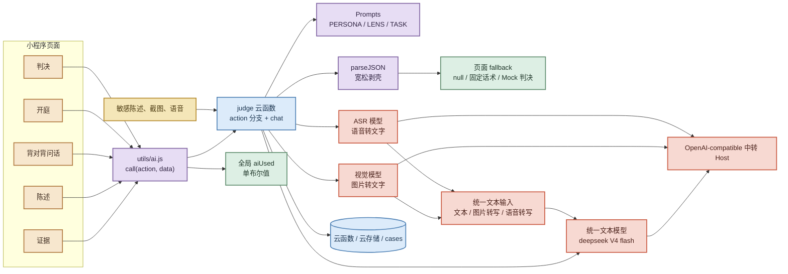

本版目标是让文本 action 统一进入 `deepseek V4 flash`；图片和语音只负责产生可追踪的文字中间结果，再进入同一文本模型。代码当前仍由环境变量决定模型，后续实施时需同步配置并验证中转服务的模型名和 `response_format` 能力。相关入口见 [utils/ai.js](../utils/ai.js#L41-L64) 和 [judge/index.js](../cloudfunctions/judge/index.js#L15-L66)。

| action | 当前用途 | MVP 目标模型 | 推荐实施方式 |
|---|---|---|---|
| intake | 复述本庭听到什么 | deepseek V4 flash | 同一文本模型 + action Prompt |
| brief | 生成中立案由 | deepseek V4 flash | 同一文本模型 + Schema |
| quickReply | stance + 3 条回复 | deepseek V4 flash | 同一文本模型 + 固定格式 |
| verdict | 主判决 | deepseek V4 flash | 同一文本模型 + Schema |
| verdictDepth | 需求、循环、边界、pacts | deepseek V4 flash | 同一文本模型，可后台补充 |
| interviewTurn / supplement | 背对背追问 | deepseek V4 flash | 同一文本模型 + 服务端隔离 |
| readScreenshots | 截图转文字后参与理解 | 视觉模型 → deepseek V4 flash | 先转写，再统一文本处理 |
| transcribe | 语音转文字后参与理解 | ASR → deepseek V4 flash | 先转写，再统一文本处理 |

### 模型平台与准确标识

当前项目使用 OpenAI-compatible 平台 `api.openai-next.com`。本版 MVP 采用的展示名称和平台模型标识如下：

| 展示名称 | 平台模型标识 | 用途 |
|---|---|---|
| DeepSeek V4 Flash | `deepseek/deepseek-v4-flash` | 所有文本理解、归纳、追问和判决生成 |

后续配置、日志、缓存键和评测记录应使用准确的平台模型标识 `deepseek/deepseek-v4-flash`，不要只写展示名称 `deepseek V4 flash`。平台公开模型清单见 [Vectrust 可用模型列表](https://openai-next.com/models/)。当前代码默认值仍在 [judge/index.js](../cloudfunctions/judge/index.js#L16-L21)，本报告不直接修改它。

## 三、推荐的 AI 编排路由

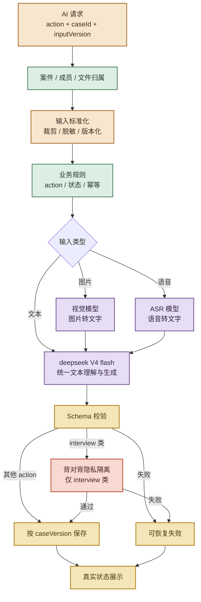

建议建立 action registry，让所有文本 action 共享模型入口，但保留各自 Prompt、Schema、超时和输出长度：

```js
{
  verdict: {
    pipeline: 'text',
    modelEnv: 'AI_TEXT_MODEL',
    model: 'deepseek/deepseek-v4-flash',
    promptVersion: 'verdict.v2',
    schemaVersion: 'verdict.v2',
    timeoutMs: 18000,
    temperature: 0.2,
    maxTokens: 1200
  },
  brief: {
    pipeline: 'text',
    modelEnv: 'AI_TEXT_MODEL',
    model: 'deepseek/deepseek-v4-flash',
    promptVersion: 'brief.v2',
    schemaVersion: 'brief.v2',
    timeoutMs: 6000,
    temperature: 0.3,
    maxTokens: 160
  }
}
```

统一路由建议：

- **文本**：intake、brief、quickReply、verdict、verdictDepth、interviewTurn、supplement 全部进入 `deepseek V4 flash`。
- **图片**：视觉模型只负责 OCR / 视觉描述，产出文字后进入 `deepseek V4 flash`。
- **语音**：ASR 只负责转写，产出文字后进入 `deepseek V4 flash`。
- **规则**：只处理输入类型、数量、长度、状态转移、幂等和 pact 确认，不负责模型分级。

当前使用 OpenAI-compatible 中转服务，模型名和 response_format 能力必须在 staging 验证，不能只凭名称假设兼容性。

## 四、Prompt 体系优化

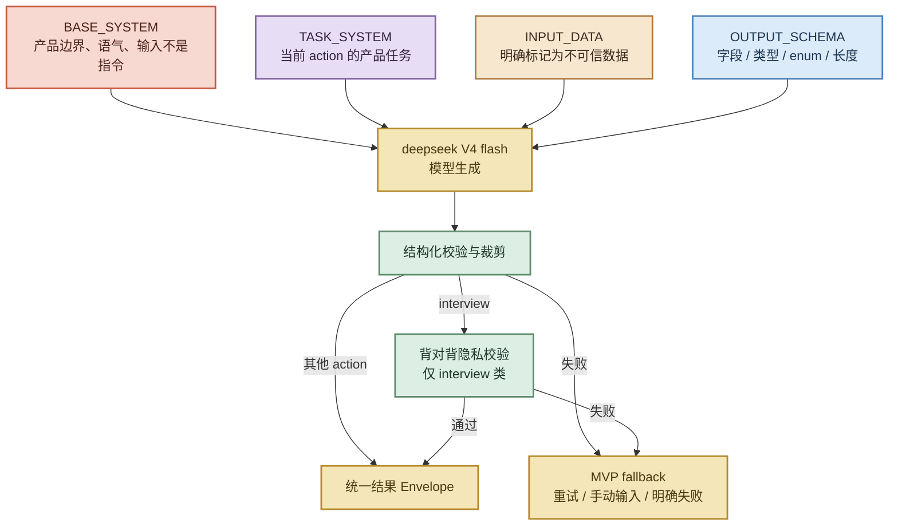

当前问题：

1. PERSONA 和 LENS 意图清楚，但所有场景共享较长约束，各 action 都携带了部分无关规则。
2. 用户陈述、截图转写、历史记录直接拼进 user message，没有明确标记“这是不可信数据，不是指令”。见 [judge/index.js](../cloudfunctions/judge/index.js#L119-L164)。
3. response_format json_object 后只做宽松剥壳和 JSON.parse，没有完整 Schema 校验。见 [judge/index.js](../cloudfunctions/judge/index.js#L23-L66)。
4. Prompt 使用 topicOnly 占位字段，但前端实际使用 result.topic 写入关系模式。见 [prompts.js](../cloudfunctions/judge/prompts.js#L55-L70) 和 [trial.js](../pages/trial/trial.js#L61-L68)。
5. caseType 示例写成一整段字符串，不是严格 enum；字段长度、数组数量、额外字段也没有服务端执行。
6. 不同 action 的结果字段和失败状态不统一；MVP 暂不引入独立安全分类器，先统一 `ok / source / fallback / result`。
7. INTERVIEW_SYSTEM 仍存在，但当前实际路由使用 plan/ask/turn 三个 Prompt，维护时容易改错文件。见 [prompts.js](../cloudfunctions/judge/prompts.js#L139-L157)。
8. 案由 Prompt 的规则与示例存在冲突，应清理冲突示例。见 [prompts.js](../cloudfunctions/judge/prompts.js#L230-L249)。

推荐输入 Envelope：

```json
{
  "inputType": "untrusted_case_data",
  "action": "verdict",
  "caseVersion": 12,
  "side": "shared",
  "myStatement": {},
  "theirStatement": {},
  "patterns": [],
  "history": []
}
```

推荐输出 Envelope：

```json
{
  "ok": true,
  "action": "verdict",
  "source": "live",
  "model": "deepseek/deepseek-v4-flash",
  "promptVersion": "verdict.v2",
  "schemaVersion": "verdict.v2",
  "requestId": "req_xxx",
  "caseVersion": 12,
  "result": {}
}
```

结构化校验、权限校验或隐私隔离失败时，默认进入 fallback，不把半成品继续传给页面。MVP 不把独立安全分类作为路由前置条件。

## 五、权限、隐私和状态机

### AI 请求状态机（MVP）

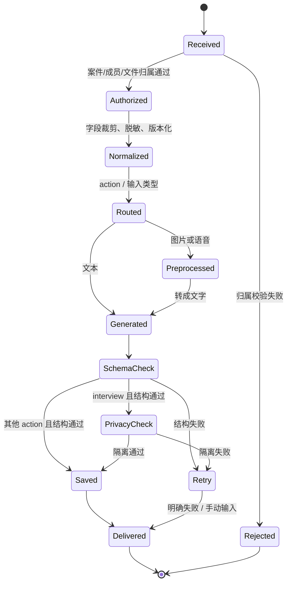

P0 阻断项：

| 项目 | 现状 | 建议 |
|---|---|---|
| AI 调用鉴权 | judge 只检查 API Key 和 action，没有统一调用者、案件成员和文件归属校验 | 服务端根据 caseId + OPENID + side 校验，禁止仅凭客户端 fileID 下载媒体 |
| 案件读写鉴权 | casedb 多个 get/save/destroy action 未形成统一成员门禁 | 抽出 assertCaseMember()，所有 action 先校验 |
| 媒体生命周期 | 截图、语音、石子图片上传后，销毁流程不能证明同步删除 | 建立媒体登记、TTL、删除补偿和供应商留存边界 |

证据：[judge/index.js](../cloudfunctions/judge/index.js#L135-L170)、[judge/index.js](../cloudfunctions/judge/index.js#L349-L380)、[casedb/index.js](../cloudfunctions/casedb/index.js#L120-L174)、[casedb/index.js](../cloudfunctions/casedb/index.js#L390-L407)。

本版不把独立安全分类器列为 MVP 阻断项；只保留权限、媒体归属、写入状态和背对背隐私隔离等产品流程必需校验。

### 背对背追问隔离图

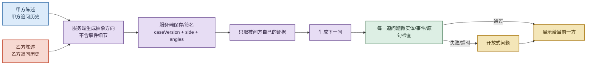

当前过滤器只检查 2-4 个连续汉字片段，且客户端可以回传未重新验证的 angles 和 history。见 [judge/index.js](../cloudfunctions/judge/index.js#L99-L117) 和 [judge/index.js](../cloudfunctions/judge/index.js#L277-L321)。

建议：

- angles、history 服务端保存或签名；
- rawStatement 包含 followups，避免追问中新事实漏进隔离比对；
- 统一空格、标点、大小写、繁简体和数字表达；
- 对人名、地点、时间、动作和聊天原句做实体/事件集合校验；
- 每一道问题都做独立隐私审核，失败或超时就使用开放式问题。

## 六、产品流程与模型路由

| 产品节点 | 推荐策略 | 是否需要 AI | 缓存/降级 |
|---|---|---:|---|
| evidence | 数量、大小、格式用规则；截图先由视觉模型转文字，再交给 deepseek V4 flash | 是 | 文件哈希 + 视觉模型版本；失败明确“未读取” |
| statement | 渐进问题、必填、字数用规则；语音先由 ASR 转文字，再交给 deepseek V4 flash | 可选 | ASR 按 fileID/哈希缓存，修改陈述即失效 |
| accept | 路由和校对用规则；复述交给 deepseek V4 flash | 可选 | AI 失败时规则化复述 |
| reply | 固定低风险话术优先 | 可选 | 固定 fallback 可保留 |
| preview | deepseek V4 flash 生成中立案由，用户最终确认 | 是 | 按陈述版本缓存 |
| share/waiting/respond | 规则路由 + 云端状态 | 否 | 写入失败禁止推进 |
| interview | deepseek V4 flash 生成方向和追问，代码规则隔离 | 是 | 只按 caseId + side + historyHash 短期缓存 |
| trial/verdict | deepseek V4 flash 生成主判决，深度分析后台补充 | 是 | 主判决和深度结果版本化保存 |
| pact/review/pebble/history | 规则 + 数据库 | 否 | 不缓存未确认关系状态 |

### 延迟与调用路由图

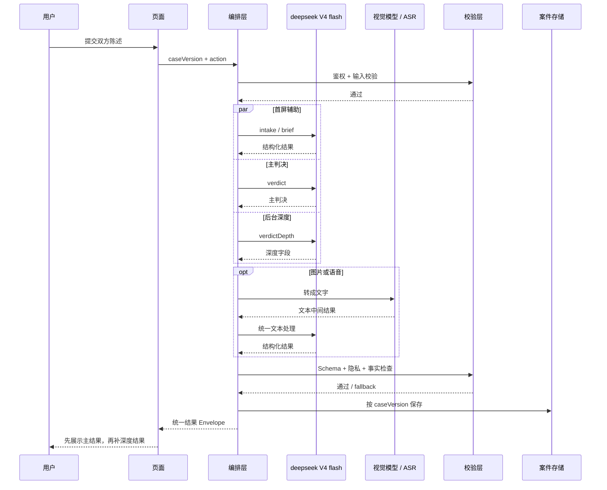

路由判断：

- verdict 和 verdictDepth 拆开是合理的，应继续并行；深度回填后必须按同一案件版本保存。
- intake 与 brief 都依赖发起方陈述，可以合并成一次文本调用，也可以并行预取，需用实际延迟和 token 成本决定。
- interviewTurn 首轮目前是规划到生成问题的串行两次；可提前生成并签名抽象方向。
- interview 隐私复核不应在 60 秒云函数内无限串行，失败时直接进入明确失败或手动输入状态。
- ASR 当前请求 timeout 为 90 秒，而云函数 timeout 为 60 秒，必须拆分或缩短预算。见 [config.json](../cloudfunctions/judge/config.json#L1-L6) 和 [judge/index.js](../cloudfunctions/judge/index.js#L33-L86)。

## 七、输出契约、版本化和可观测性

当前 chat 只返回模型解析结果，前端用全局 aiUsed 记录是否使用 AI；并行调用会互相覆盖。见 [utils/ai.js](../utils/ai.js#L10-L27) 和 [verdict.js](../pages/verdict/verdict.js#L49-L71)。

建议所有 action 返回统一 Envelope：

```json
{
  "ok": true,
  "action": "verdict",
  "source": "live",
  "model": "deepseek V4 flash",
  "promptVersion": "verdict.v2",
  "schemaVersion": "verdict.v2",
  "requestId": "req_xxx",
  "caseId": "case_xxx",
  "caseVersion": 12,
  "fallback": null,
  "result": {}
}
```

后端至少校验：合法 JSON、必填字段、字段类型、caseType 枚举、index 取值、topic 存在、pacts 数量和长度、额外字段裁剪；MVP 不把 safety 分类作为前置路由条件。

Prompt 和模型版本至少记录：

```text
action: verdict
promptVersion: verdict.v2
schemaVersion: verdict.v2
model: deepseek/deepseek-v4-flash
promptHash: sha256(...)
inputVersion: caseVersion-12
```

日志只保留 fixture ID、哈希、耗时、token usage、provider request ID、失败类型和过滤结果，不记录原始陈述、原句、命中片段或完整 Prompt。当前过滤器会直接打印问题文本和命中片段，需脱敏。见 [judge/index.js](../cloudfunctions/judge/index.js#L228-L270)。

## 八、缓存、成本和降级

适合缓存：

- readScreenshots：文件哈希 + 视觉模型版本；
- transcribe：音频哈希/fileID + ASR 模型版本；
- intake/brief/quickReply：规范化陈述哈希 + Prompt/模型版本；
- verdict/depth：案件版本、双方陈述、追问、patterns、Prompt/模型版本。

谨慎缓存：

- interview：只能绑定 caseId + side + historyHash；
- text result：输入任何变化都必须重新生成或命中同版本缓存；
- pact：必须绑定具体 verdict 版本。

| action | 可接受降级 | 不可接受降级 |
|---|---|---|
| brief | 固定中立案由 | 编造具体事实 |
| quickReply | 固定低风险话术 | 确定性指责 |
| transcribe | 回到手动输入 | 把空转写当成用户说过的话 |
| readScreenshots | 明确未读取，允许跳过 | 静默当成成功 |
| interview | 固定开放式问题 | 带入另一方细节 |
| verdict | 真实模式显示生成中/重试 | 展示默认 Mock 冒充真实判决 |

默认 Mock 判决在 [app.js](../app.js#L30-L43)，而 trial 在生成结果为空时仍会进入判决页，真实模式应改成显式生成中/失败状态。见 [trial.js](../pages/trial/trial.js#L48-L71)。

## 九、评测方案

### 彩色评测闭环图

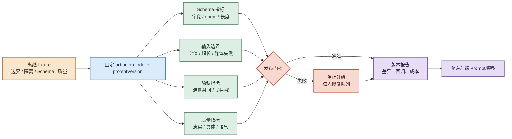

至少建立四组 fixture：

1. **输入边界**：空值、超长、非法 action、重复请求、图片/音频转写失败。
2. **隐私隔离**：直接搬运、同义改写、人名/地点/时间变体、截图、ASR、追问新事实、客户端篡改 side/angles/history。
3. **Schema**：缺字段、错类型、非法 enum、超长、数组数量不符、额外字段、topic 缺失。
4. **产品质量**：判行为不判人、无责任比例、忠实双方陈述、缺席不定责、breach 明确修复、pacts 不空泛、分享文案脱敏。

输入边界、隐私隔离、Schema 和产品质量应设为 MVP 发布门槛；关键指标回退时不升级 Prompt 或模型版本。

## 十、优先级路线图

### P0：真实敏感数据前

- judge 和 casedb 的调用者、案件成员、side、媒体归属鉴权；
- 媒体登记、TTL、删除补偿和供应商留存边界；
- 写操作返回 saved / failed / retryable，失败不得继续推进；
- 显式 MOCK_MODE，禁止真实模式展示默认 Mock 判决。

### P1：前端产品化和 Prompt v2 前

- action registry 和统一文本模型 `deepseek V4 flash` 路由；
- JSON Schema、统一结果 Envelope、topic/caseType 契约修复；
- angles/history 服务端保存或签名；
- 统一超时预算，解决 60 秒云函数与 90 秒 ASR 冲突；
- aiStatus[action] 替代全局 aiUsed；
- Prompt、Schema、模型和输入版本记录。

### P2：规模化前

- 输入哈希缓存、token usage、成本账本、限流和预算熔断；
- 结构化脱敏日志、request ID、provider request ID、指标和告警；
- action 契约测试、隐私隔离测试、输入边界回归、双账号 E2E 和 CI；
- 清理未使用的 INTERVIEW_SYSTEM 或明确兼容关系；
- 深度判决回填后按同一案件版本原子保存。

## 十一、最终判断

这套产品最有价值的 AI 能力是“把双方分别听见，再共同整理成一份可执行的判决”，因此优化方向应优先保护：

1. 不泄露对方原话；
2. 不把 Mock、失败或过期结果包装成真实判决；
3. 不让图片、语音转写结果绕过统一文本处理链。

推荐实施顺序：

```text
鉴权与媒体边界
→ 输入边界与失败状态
→ 输出 Schema 与案件版本
→ 背对背隔离服务端化
→ 统一 deepseek V4 flash 路由与超时预算
→ Prompt v2 与模型调优
→ 缓存、成本和持续评测
```

当前审查结论：**适合继续本地 Mock 和 Prompt/路由实验；不适合接入真实敏感关系数据，也未达到真实双账号或生产 AI readiness。**

## 十二、模型调用积分体系与后台配置

### 12.1 MVP 设计原则

积分是模型调用额度，不等同于人民币，也不在 MVP 阶段直接绑定支付、充值或退款订单。每个微信账号以 `OPENID` 作为账户主键，所有积分变更由云函数完成，客户端不能提交费用、套餐或扣费结果。

本方案采用“预扣 → 调用 → 结算/释放”的账务模型：

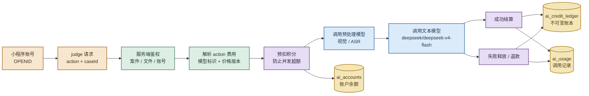

### 12.2 建议的 MVP 扣费单位

积分基线不是永久价格，后台应通过价格版本调整。第一版可以先采用整数积分，避免把 Token、美元和人民币直接暴露给产品页面。

| action / 调用组 | 建议积分 | 计费说明 |
|---|---:|---|
| intake | 1 | 单次文本复述 |
| brief | 1 | 单次案由生成 |
| quickReply | 1 | 单次回复建议 |
| interviewTurn | 2 | 单轮背对背追问 |
| supplement | 2 | 判决后的补充追问 |
| interview | 3 | 规划方向 + 生成问题 |
| verdict | 6 | 主判决 |
| verdictDepth | 4 | 深度分析 |
| trial bundle | — | Phase 2；补齐 `trialRunId`、`caseDocId`、`caseVersion`、`billingGroupId` 后再合并计费，MVP 不启用 |
| readScreenshots | 3 | 视觉转文字 + 统一文本处理，最多 4 张 |
| transcribe | 2 | 单段语音转写，建议限制时长 |
| ping / 本地 Mock | 0 | 只允许开发环境使用 |

规则：

- 客户端只传 `action`，费用由服务端根据 action、输入大小、模型和价格版本计算。
- `verdict` 与 `verdictDepth` 当前会并行调用，但 MVP 先分别按 action 计费；当前代码缺少可靠的 `caseVersion`、`trialRunId`、`billingGroupId` 和服务端案件所有者鉴权，暂不做共享计费组。Phase 2 补齐这些字段后再评估最多扣 10 积分的 trial bundle。
- `interview` 内部可能包含多次模型调用，MVP 按一个逻辑 action 的固定预算预扣；`subCallCount` 只用于计量和排障，不在调用中途临时拆账。
- 图片和语音的积分包含预处理及后续文本处理；如果只是单独转写、不继续生成文本，则按对应预处理价格计费。
- 失败、超时、鉴权失败、额度不足不应产生最终扣费；模型已成功返回但 Schema 校验失败，MVP 建议全额释放或退款。
- 同一个幂等键重复请求只返回原结果，不重复扣费。

### 12.3 账户、账本和调用记录

建议新增以下集合。敏感陈述和完整 Prompt 不写入积分系统，只记录哈希、版本和必要的调用元数据。

| 集合 | 作用 | 关键字段 |
|---|---|---|
| `ai_accounts` | 每个 OPENID 的余额和额度聚合 | `openid`、`planId`、`available`、`reserved`、`lifetimeGranted`、`lifetimeConsumed`、`dailyLimit`、`monthlyLimit`、`status`、`version` |
| `ai_credit_ledger` | 不可变积分流水 | `ledgerId`、`openid`、`type`、`amount`、`balanceAfter`、`action`、`requestId`、`caseId`、`priceVersion`、`operatorOpenid`、`reason`、`createdAt` |
| `ai_usage` | 一次模型调用的成本与结果 | `requestId`、`idempotencyKey`、`openid`、`action`、`model`、`promptVersion`、`inputVersion`、`reservedPoints`、`chargedPoints`、`releasedPoints`、`status`、`latencyMs`、`tokenUsage` |
| `ai_plans` | 套餐、价格和限额配置 | `planId`、`actionCosts`、`dailyLimit`、`monthlyLimit`、`initialGrant`、`allowedActions`、`version`、`effectiveAt` |
| `ai_admin_audit` | 后台操作审计 | `operatorOpenid`、`targetOpenid`、`operation`、`delta`、`before`、`after`、`reason`、`requestId`、`createdAt` |

账户聚合和账本的关系：

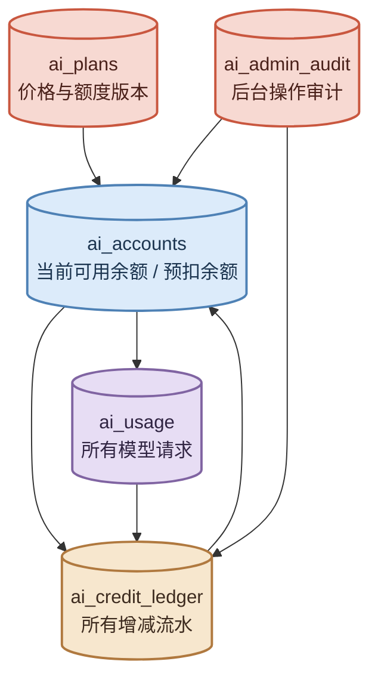

实现注意：积分扣减必须带 `idempotencyKey`，并使用云数据库事务或“条件更新 + 操作记录”防止并发重复扣费。不能先读余额、再普通 update，因为两个并发请求可能同时通过余额检查。

### 12.4 一次调用的积分状态机

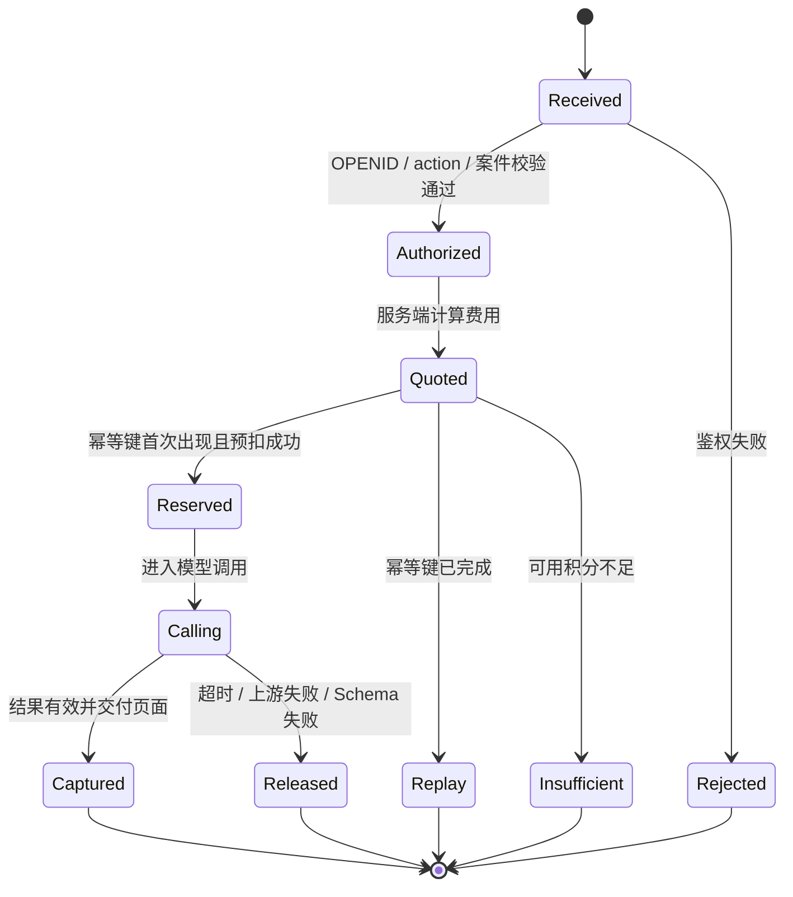

统一返回给页面的 `billing` 字段：

```json
{
  "requestId": "req_xxx",
  "idempotencyKey": "case_xxx:verdict:caseVersion-12",
  "billing": {
    "chargedPoints": 6,
    "releasedPoints": 0,
    "availablePoints": 44,
    "priceVersion": "mvp-20260823-v1",
    "status": "captured"
  }
}
```

页面只展示“本次消耗 X 积分、剩余 Y 积分”和明确的额度不足/调用失败状态，不展示供应商成本、API Key 或内部账本细节。

### 12.5 后台如何配置每个账户

配置优先级建议如下：

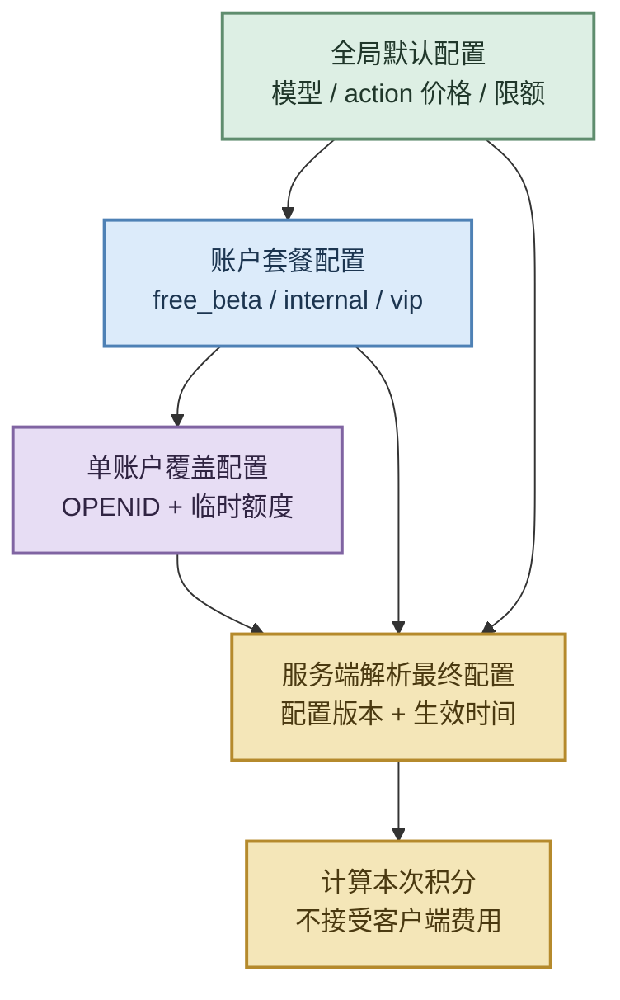

后台最小能力：

| 后台操作 | 作用 | 约束 |
|---|---|---|
| 查询账户 | 按 OPENID 查询余额、预扣、套餐、最近调用 | 只允许管理员角色 |
| 发放积分 | 新用户赠送、活动补发、人工补偿 | 必须填写原因，写入正向账本 |
| 调整积分 | 扣回误发、纠正异常余额 | 不直接改余额，写入负向调整流水 |
| 分配套餐 | 切换 `free_beta`、内部测试或其他套餐 | 记录生效时间和操作者 |
| 设置账户覆盖 | 单独改每日/月度限额、action 价格或临时额度 | 设置过期时间，优先级高于套餐 |
| 冻结/解冻 | 禁止该账号继续调用模型 | 不删除历史余额和流水 |
| 查看调用 | 查看 action、模型、耗时、积分和失败原因 | 不显示原始陈述和完整 Prompt |

建议后台不要提供“直接设置余额”按钮，而提供“发放、扣回、冻结、分配套餐”四类动作。这样每次变化都有来源，余额可以由账本审计。

管理员身份不能由客户端传入。MVP 可以先使用云函数环境变量中的管理员 OPENID 白名单；后续再迁移到 `admin_roles` 集合或微信登录后的后台角色体系。所有后台变更都写入 `ai_admin_audit`。

### 12.6 MVP 套餐建议

第一版只做内部赠送，不做支付：

| 套餐 | 初始积分 | 每日上限 | 月度上限 | 用途 |
|---|---:|---:|---:|---|
| `free_beta` | 50 | 20 | 200 | 普通 MVP 体验账号 |
| `internal` | 500 | 100 | 3000 | 产品、设计和测试账号 |
| `frozen` | 0 | 0 | 0 | 禁用模型调用但保留历史 |

这些数字是可调的初始建议，不应写死在页面或云函数分支里。真正的价格和额度来自 `ai_plans` 的当前生效版本。

### 12.7 推荐实施顺序

1. **P0：只读计量**：先给每次 judge 请求生成 `requestId`、action、模型标识、耗时和 token usage，不扣积分。
2. **P1：服务端账本**：增加 `ai_accounts`、`ai_credit_ledger`、`ai_usage`，实现预扣、释放、结算和幂等。
3. **P1：统一返回**：页面接收 `billing`，处理余额不足、失败释放和重复请求。
4. **P2：后台配置**：先做账户查询、发放、扣回、套餐和冻结；所有操作写审计。
5. **P3：商业化**：未来如果接入充值，再新增订单和支付域，不把支付金额直接混入积分账本。

最终建议：**MVP 先按账号赠送积分、按 action 固定整数扣费、服务端预扣并记录不可变流水；暂时不做复杂动态 Token 计费和支付。**

## 十三、相关文件

- [当前 AI 适配层](../utils/ai.js)
- [当前 judge 云函数](../cloudfunctions/judge/index.js)
- [当前 Prompt 定义](../cloudfunctions/judge/prompts.js)
- [项目技术架构](technical-architecture.md)
- [项目当前状态](status.md)
- [前端交互架构调研](调试与前端交互架构调研.md)
