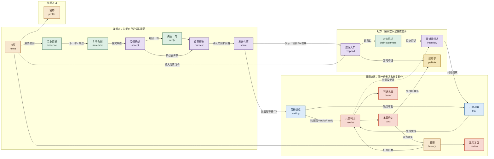
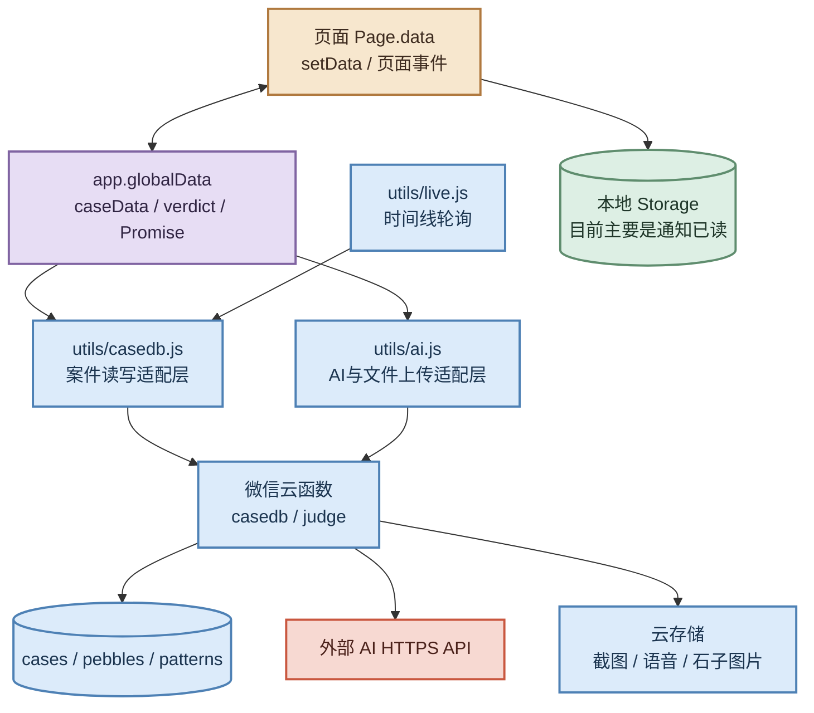

# 小程序调试与前端交互架构调研

> 调研日期：2026-08-23  
> 调研范围：`07-代码/miniprogram-demo` 现有前端、工具层、云函数骨架与项目状态文档  
> 调研方式：4 个 subagent 并行只读扫描 + 主 agent 交叉核对 + JavaScript/JSON 静态检查  
> 本文只记录现状，不把截图、README 或模拟器跑通等同于真实双设备、真实 AI 或生产安全验收。

## 结论：现在能不能进入前端开发？

可以。现有代码已经是可运行的前端 MVP 骨架，下一阶段是“按视觉规范产品化”，不是重新搭建页面。

当前已有 19 个页面、主流程 mock 回退链路、全局视觉基础类、猫猫组件和云函数接入骨架。视觉/UI 评审完成后，前端开发应同步完成三件事：

1. 为每页定义加载、空态、失败、重复提交、返回和权限拒绝等状态；
2. 为关键节点补 `qa-*` 选择器，形成 Codex/MCP 调试契约；
3. 明确本轮运行模式：当前具备 mock 回退链路，但默认运行时会尝试连接固定云环境。

真实双账号、鉴权、敏感文件销毁和生产 AI 验收仍不属于当前 MVP 的完成条件。

## 一、彩色交互架构图



图中最重要的分叉是：

- `accept` 是发起方的决策点：发传票、先回一句、补充陈述、暂缓；
- `share` 后可以进入真实等待，也可以在单机演示中直接切到 TA 视角；
- `interview` 是双方证词汇合前的隔离层，不应让一方看到另一方原话；
- `verdict` 不是终点，后面还有约定、石子、卷宗、复盘和“补充后重审”。

## 二、页面与路由现状

### 页面清单

页面注册见 [`app.json`](../app.json#L2-L22)，当前共 19 个页面：

`home`、`evidence`、`statement`、`accept`、`reply`、`preview`、`share`、`waiting`、`respond`、`their-statement`、`interview`、`trial`、`verdict`、`poster`、`pact`、`pebble`、`history`、`review`、`profile`。

应用没有 `tabBar`，代码中也没有 `wx.switchTab`。当前路由策略是：

| 路由方式 | 当前用途 | 代表位置 |
|---|---|---|
| `navigateTo` | 普通进入子页面，保留页面栈 | `home → evidence`、`verdict → pact` |
| `redirectTo` | 流程节点替换，控制页面栈深度 | `statement → accept`、`trial → verdict` |
| `reLaunch` | 回到首页，结束当前流程 | `review → home`、安全提示后回首页 |
| `navigateBack` | 从预览页回到已有陈述页 | `preview.edit()` |

项目 README 已说明流程中段使用 `redirectTo`，主要是规避小程序 10 层页面栈上限；实际调用见 [`pages/statement/statement.js`](../pages/statement/statement.js#L121-L133)、[`pages/trial/trial.js`](../pages/trial/trial.js#L48-L72) 和 [`pages/preview/preview.js`](../pages/preview/preview.js#L55-L60)。

### 页面状态机

`app.globalData.caseData` 的注释给出了主状态：

```text
created → accepted → summoned → responded → tried → closed
```

实现上需要注意：

- `accepted` 在陈述提交后写入内存；
- `summoned` 当前主要在分享页写入内存，分享确认并没有独立的云端状态更新；
- `responded` 在对方陈述完成后写入内存并尝试写云端；
- `tried` 在判决页加载时写入内存；
- `closed` 在双方确认约定后写入内存。

因此，状态机目前更像“前端演示状态 + 云函数骨架”，不是已经完成一致性校验的生产状态机。来源：[`app.js`](../app.js#L15-L23)、[`pages/share/share.js`](../pages/share/share.js#L21-L29)、[`pages/pact/pact.js`](../pages/pact/pact.js#L88-L92)。

## 三、数据流与异步边界



### 当前数据边界

- 页面输入先留在 `Page.data`，跨页面主要依赖 `app.globalData.caseData`；
- 案件数据通过 `utils/casedb.js` 调用 `casedb` 云函数；
- AI、截图识别、语音转写和文件上传通过 `utils/ai.js` 调用 `judge` 云函数；
- 等待页通过 [`utils/live.js`](../utils/live.js#L11-L47) 每 3 秒轮询一次案件时间线，无变化一段时间后放慢到 8 秒；
- 明确的本地持久化目前主要是通知已读标记，见 [`utils/notify.js`](../utils/notify.js#L16-L26)；
- 应用重启后，内存中的 `caseData`、`verdict` 和跨页 Promise 会丢失，只有页面主动重新读云端时才能恢复部分案件信息。

开发模式的边界和切换要求集中在“开发前置检查与风险”章节；不要把 mock 回退链路、staging 云环境和真实双设备验收混为同一完成标准。

## 四、关键数据交互

| 阶段 | 页面行为 | 主要数据与异步边界 |
|---|---|---|
| 发起方 | `home → evidence → statement → accept` | 截图最多选 9 张、最多上传 4 张；陈述写入 `caseData.myStatement`，并创建/更新案件；受理复述通过跨页 `intakePromise` 返回。见 [`evidence.js`](../pages/evidence/evidence.js#L41-L73)、[`statement.js`](../pages/statement/statement.js#L102-L133)。 |
| 传票 | `accept → reply/preview → share` | 预览页只把邀请语和中立案由交给对方；分享页支持原生转发、口令和单机切换 TA 视角。见 [`preview.js`](../pages/preview/preview.js#L22-L53)、[`share.js`](../pages/share/share.js#L32-L57)。 |
| 应诉 | `respond → their-statement → interview` | 对方证词单独写入 `theirStatement`；问话最多 3 轮，可回答、跳过或语音输入，不直接展示另一方原话。见 [`interview.js`](../pages/interview/interview.js#L49-L123)。 |
| 判决 | `interview/waiting → trial → verdict` | `trial` 并行播放动画、读取关系模式并生成判决；等待页用时间线轮询，缺席审判也可进入 `trial`。见 [`trial.js`](../pages/trial/trial.js#L18-L48)、[`waiting.js`](../pages/waiting/waiting.js#L31-L57)。 |
| 修复 | `verdict → pact/pebble/poster` | 约定状态为 `choose → wait/confirm → done`；石子支持表情、歌曲、图片；卷宗和复盘是长期入口。见 [`pact.js`](../pages/pact/pact.js#L44-L93)、[`pebble.js`](../pages/pebble/pebble.js#L60-L110)。 |

## 五、开发前置检查与风险

### 必须先明确的边界

| 项目 | 当前状况 | 开发要求 |
|---|---|---|
| 运行模式 | `CLOUD_ENV` 非空，默认会初始化固定云环境；准确表述应是“mock 回退链路”，不是“纯本地 mock” | UI 阶段明确只跑 mock，或切到隔离的 staging 环境。见 [`app.js`](../app.js#L1-L10)。 |
| 数据安全 | `casedb` 多个动作需要专项成员鉴权审查；截图、语音和石子图片的删除闭环尚未证明 | 真实用户/双账号前不能视为生产安全。见 [`cloudfunctions/casedb/index.js`](../cloudfunctions/casedb/index.js#L120-L167)。 |
| 自动化定位 | 当前没有 `qa-*` / `data-testid`，主要依赖文本、通用 class 和索引 | UI 落地时给主按钮、输入框、路由入口、结果节点补稳定选择器。 |

### 前端首轮应处理的风险

| 风险 | 代码表现 | 建议 |
|---|---|---|
| 假成功 | `casedb` 异常统一变成 `null`，部分页面仍显示保存成功 | 写操作区分 `saved / failed / retrying`，不要只依赖 toast。见 [`utils/casedb.js`](../utils/casedb.js#L2-L16)。 |
| 重复提交 | 证据页按钮有 disabled 样式，但 `next()` 未先阻断 `reading` | 所有异步主动作统一加幂等锁和失败恢复。见 [`evidence.js`](../pages/evidence/evidence.js#L41-L73)。 |
| 卡 loading / 竞态 | 受理、案由、判决依赖 Promise；页面还有固定延时和自动跳转 | 补 `catch/finally`，MCP 按路由和状态断言，不按固定 sleep 判断。 |
| 上下文丢失 | 页面高度依赖 `app.globalData`；重启后内存案件、判决和跨页 Promise 会丢失 | 为中间页定义最小入口数据和空上下文 fallback。 |
| 平台差异 | 录音、选图、离屏 Canvas、保存相册依赖真机/权限 | 单列权限和真机场景，不与普通 mock 冒烟混合。 |

## 六、前端开发与回归顺序

### 1. UI 评审完成后冻结交互契约

- 每页至少定义：初始、输入中、提交中、成功、失败、空态、返回；
- 明确跳过、返回保留输入、失败重试和权限拒绝的行为；
- 先补首轮选择器：

  ```text
  qa-home-start-case / qa-evidence-next / qa-statement-submit
  qa-accept-send-summons / qa-share-simulate-ta / qa-respond-start
  qa-interview-submit / qa-trial-result / qa-verdict-go-pact
  ```

### 2. 按垂直切片开发

1. `home → evidence → statement → accept`：表单状态和失败状态；
2. `preview → share → respond → their-statement`：隐私展示和演示切视角；
3. `interview → trial → verdict`：等待、超时、mock 回退和自动跳转；
4. `pact → pebble → history → review/profile`：双向状态和重启恢复。

### 3. 用 Codex + weapp-agent-mcp 做短场景回归

统一步骤：

```text
mp_ensureConnection
→ mp_healthCheck
→ 读取路由和关键元素
→ 执行一个短动作
→ 断言真实路由/关键数据
→ 必要时串行截图
```

首批建议场景：

| 场景 | 入口 | 关键断言 |
|---|---|---|
| 发起方立案 | `pages/home/home` | 到达 `accept`，`caseData.myStatement` 有内容 |
| 单机演示应诉 | `pages/share/share` | 到达 `verdict`，不泄露另一方原话 |
| 判决后修复 | `pages/verdict/verdict` | `pact` 能进入 `wait/confirm/done` |

## 七、本次检查结果与边界

本次没有修改业务源码，也没有上传、发布、访问真实用户数据或调用真实外部 AI。

- `node --check`：通过；
- `jq` JSON 检查：通过；
- 微信开发者工具编译和完整 MCP 冒烟：仍待单独记录；
- 本文是静态代码调研，不代表模拟器、真机、双账号和云端环境已逐一通过。

## 八、相关文档

- [项目当前状态](status.md)
- [QA 与验证记录](qa/README.md)
- [产品契约](product.md)
- [微信开发者工具与 Codex 联调工作流](../../06-进度记录/微信开发者工具与Codex联调工作流.md)
